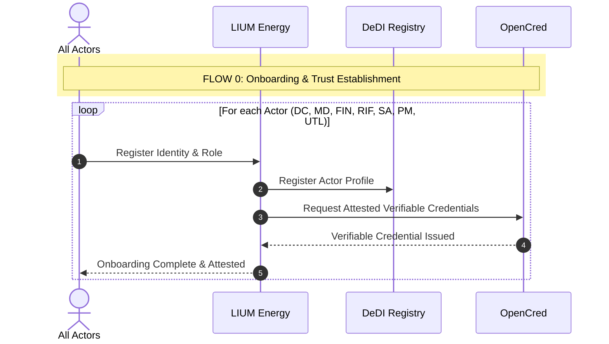
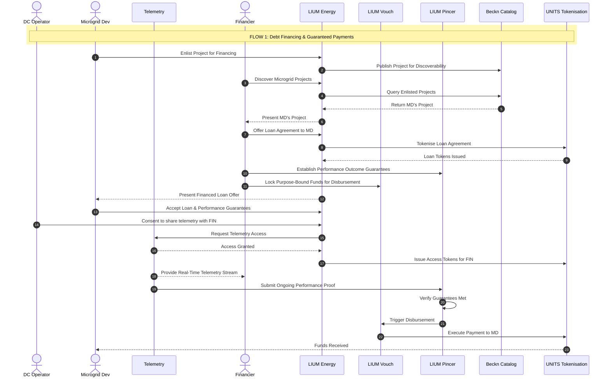
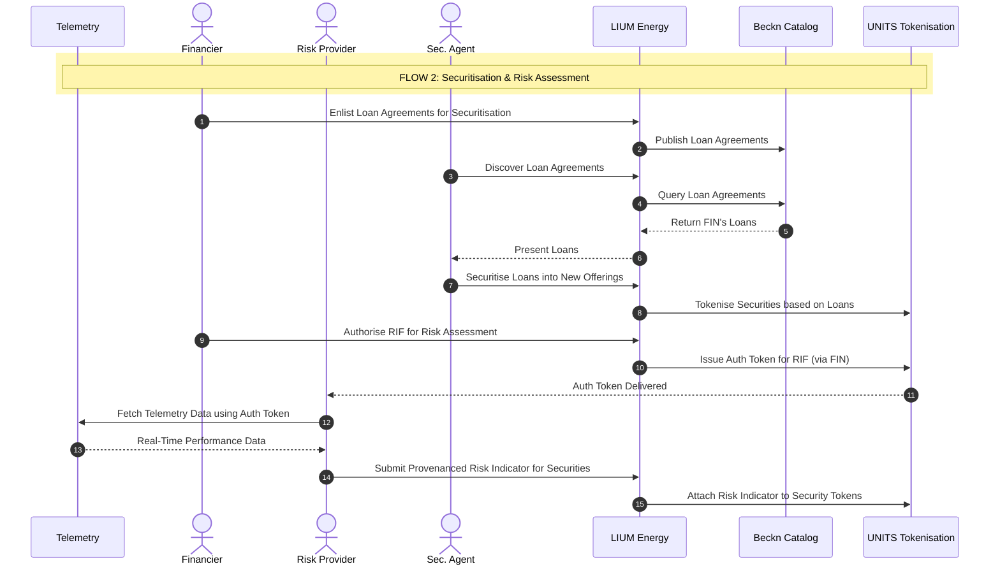
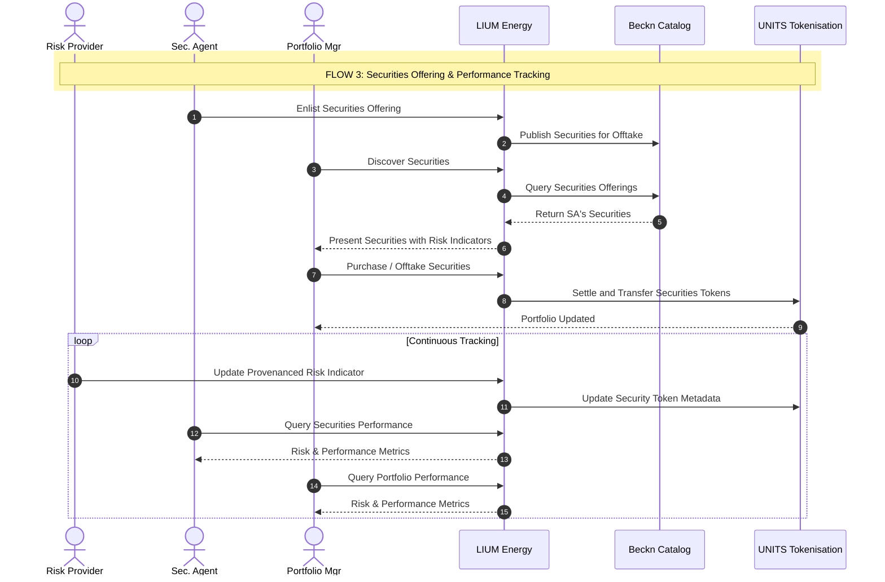
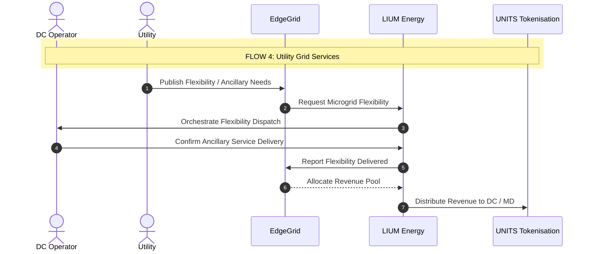
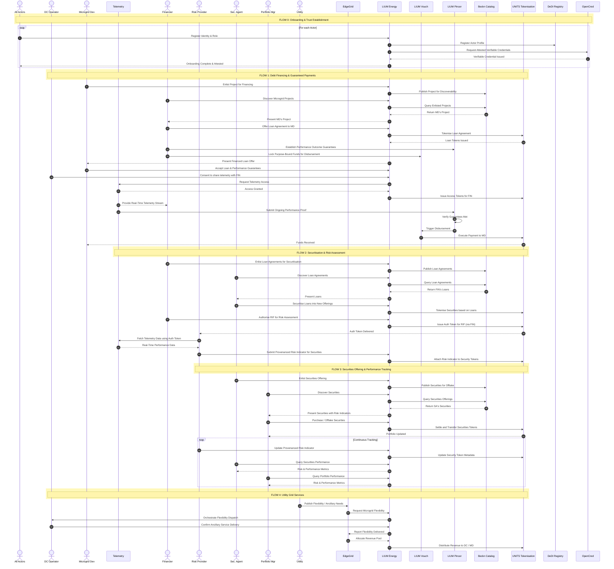

# LIUM Energy Complete Machine-Readable Documentation

This file contains the full LIUM Energy MicroGrid Energy Securitization content, including the actor/component explainer, Flow 0 through Flow 4, Mermaid code for every flow, the consolidated sequence diagram code, machine-readable JSON/YAML structures, implementation notes, and the consolidated diagram image reference.

# LIUM Energy - MicroGrid Energy Securitization Machine-Readable Specification

## Source Context

This document converts the provided LIUM Energy MicroGrid Energy Securitization architecture, actor descriptions, and sequence diagrams into a single machine-readable markdown file.

It includes:

- full actor and component inventory
- full flow descriptions
- step-by-step sequence definitions
- Mermaid sequence diagram code for every flow
- consolidated Mermaid sequence diagram
- structured JSON model for use by another codebase
- machine-readable event/message objects for each flow

---

# 1. Product / Use Case

```yaml
product:
  name: LIUM Energy
  use_case: MicroGrid Energy Securitization
  description: >
    This architecture is orchestrated by LIUM Energy, which acts as the
    single pane of glass for all external actors. Behind the scenes, LIUM
    interfaces with the NFH Fabric to manage discovery, tokenisation, and trust.
  architecture_groups:
    - External Actors & Platforms
    - Orchestrators & Apps
    - NFH Fabric Components
```

---

# 2. Actors and Components Explainer

## 2.1 Orchestrator & Enablers

```yaml
orchestrators_and_enablers:
  - id: 15
    name: LIUM Energy
    label: LIUM Energy (#15)
    role: Master Orchestrator
    description: >
      It sits above the NFH Fabric, onboarding all actors and routing
      interactions to the correct fabric layers.

  - id: 16
    name: LIUM Vouch
    label: LIUM Vouch (#16)
    role: Purpose-bound programmable value layer
    description: >
      Provides purpose-bound programmable value, ensuring payments are
      disbursed to the right person under the right conditions.

  - id: 17
    name: LIUM Pincer
    label: LIUM Pincer (#17)
    role: Guarantee envelope / performance verification layer
    description: >
      Provides the guarantee envelope, verifying performance outcomes
      cryptographically and triggering the disbursement via Vouch.
```

## 2.2 External Actors & Platforms

```yaml
external_actors_and_platforms:
  - id: 1
    name: DC Operator
    label: DC Operator (#1)
    description: >
      The datacenter operator consuming the energy.

  - id: 2
    name: Microgrid Developer
    label: Microgrid Developer (#2)
    description: >
      Connects physical energy assets and raises debt for their deployment.

  - id: 3
    name: Microgrid Telemetry Platform
    label: Microgrid Telemetry Platform (#3)
    description: >
      Collects and manages real-time performance data from the microgrids.

  - id: 4
    name: Microgrid Financial Management Platform
    label: Microgrid Financial Management Platform (#4)
    description: >
      Manages internal financials for the microgrids.

  - id: 5
    name: Financiers
    label: Financiers (#5)
    description: >
      Provide debt financing/loans to the Microgrid Developer.

  - id: 6
    name: Trusted Risk Indicator Feed Provider
    label: Trusted Risk Indicator Feed Provider (#6)
    description: >
      Analyzes telemetry to provide provenanced risk indicators for the securities.

  - id: 7
    name: Securities Agent
    label: Securities Agent (#7)
    description: >
      Packages the financed loan agreements into securitised offerings.

  - id: 8
    name: Portfolio Manager
    label: Portfolio Manager (#8)
    description: >
      Discovers and purchases the securitised offerings.

  - id: 13
    name: Utility
    label: Utility (#13)
    description: >
      The broader energy grid utility looking for flexibility and ancillary services.

  - id: 14
    name: Utility EdgeGrid Platform
    label: Utility EdgeGrid Platform (#14)
    description: >
      The operational platform that interfaces between the Utility and external
      assets, like LIUM, for grid services.
```

## 2.3 NFH Fabric Components

```yaml
nfh_fabric_components:
  - id: 9
    name: Beckn Catalog
    label: Beckn Catalog (#9)
    description: >
      The discovery engine. Enlists projects, loans, and securities.

  - id: 10
    name: UNITS
    label: UNITS (#10)
    description: >
      The Tokenisation Engine. Tokenises loan agreements and securities,
      manages programmable transfers, and issues access tokens.

  - id: 11
    name: DeDI Registry
    label: DeDI Registry (#11)
    description: >
      The Decentralised Identity Registry. Registers actor profiles to establish
      trust in the network.

  - id: 12
    name: OpenCred
    label: OpenCred (#12)
    description: >
      The Credentialing layer. Issues attested Verifiable Credentials for the
      registered actors.
```

---

# 3. Flow Index

```yaml
flows:
  - id: flow_0
    name: Onboarding & Trust Establishment
    purpose: LIUM acts as the gateway to onboard all critical participants to the network.
  - id: flow_1
    name: Debt Financing & Guaranteed Payments
    purpose: >
      The Microgrid Developer raises debt, and the Financier leverages LIUM
      Pincer and Vouch to ensure funds are disbursed only when performance
      guarantees are met.
  - id: flow_2
    name: Securitisation & Risk Assessment
    purpose: >
      The Financier's loans are securitised, and the Financier authorizes the
      Risk Provider to access telemetry to generate provenanced risk indicators.
  - id: flow_3
    name: Securities Offering & Performance Tracking
    purpose: >
      The securities are offered to the market. The Securities Agent and
      Portfolio Manager continuously monitor the asset's risk.
  - id: flow_4
    name: Utility Grid Services
    purpose: >
      The Microgrids provide ancillary services back to the main grid,
      generating additional revenue.
```

---

# 4. FLOW 0: Onboarding & Trust Establishment

## 4.1 Flow Narrative

LIUM acts as the gateway to onboard all critical participants to the network.

**Onboarding Loop:** For every actor - DC Operator, Microgrid Developer, Financier, Risk Provider, Securities Agent, Portfolio Manager, and Utility - the actor registers their identity with LIUM.

**Attestation:** LIUM registers their profile in the DeDI Registry (#11) and requests an attested Verifiable Credential from OpenCred (#12), establishing them as verified participants.

## 4.2 Flow 0 Participants

```yaml
flow_0_participants:
  - All Actors
  - LIUM Energy
  - DeDI Registry
  - OpenCred
```

## 4.3 Flow 0 Step List

```yaml
flow_0_steps:
  - step: 1
    from: All Actors
    to: LIUM Energy
    message: Register Identity & Role
  - step: 2
    from: LIUM Energy
    to: DeDI Registry
    message: Register Actor Profile
  - step: 3
    from: LIUM Energy
    to: OpenCred
    message: Request Attested Verifiable Credentials
  - step: 4
    from: OpenCred
    to: LIUM Energy
    message: Verifiable Credential Issued
  - step: 5
    from: LIUM Energy
    to: All Actors
    message: Onboarding Complete & Attested
```

## 4.4 Flow 0 Mermaid Sequence Diagram



---

# 5. FLOW 1: Debt Financing & Guaranteed Payments

## 5.1 Flow Narrative

The Microgrid Developer raises debt, and the Financier leverages LIUM Pincer and Vouch to ensure funds are disbursed only when performance guarantees are met.

**Project Listing:** The Microgrid Developer (#2) enlists their project. LIUM publishes it to the Beckn Catalog, allowing the Financier (#5) to discover it.

**Loan Tokenisation & Guarantees:** The Financier offers a loan, which is tokenised via UNITS. Crucially, the Financier establishes outcome guarantees using LIUM Pincer (#17) and locks the disbursement funds using LIUM Vouch (#16).

**Telemetry Access:** The Developer accepts, and the DC Operator (#1) consents to share telemetry. LIUM issues access tokens so the Financier can receive real-time streams.

**Orchestrated Payout:** The Telemetry Platform streams ongoing proof to LIUM Pincer. Once Pincer cryptographically verifies the guarantees are met, it triggers LIUM Vouch to disburse the payment via UNITS.

## 5.2 Flow 1 Participants

```yaml
flow_1_participants:
  - DC Operator
  - Microgrid Developer
  - Telemetry
  - Financier
  - LIUM Energy
  - LIUM Vouch
  - LIUM Pincer
  - Beckn Catalog
  - UNITS Tokenisation
```

## 5.3 Flow 1 Step List

```yaml
flow_1_steps:
  - step: 1
    from: Microgrid Developer
    to: LIUM Energy
    message: Enlist Project for Financing
  - step: 2
    from: LIUM Energy
    to: Beckn Catalog
    message: Publish Project for Discoverability
  - step: 3
    from: Financier
    to: LIUM Energy
    message: Discover Microgrid Projects
  - step: 4
    from: LIUM Energy
    to: Beckn Catalog
    message: Query Enlisted Projects
  - step: 5
    from: Beckn Catalog
    to: LIUM Energy
    message: Return MD's Project
  - step: 6
    from: LIUM Energy
    to: Financier
    message: Present MD's Project
  - step: 7
    from: Financier
    to: LIUM Energy
    message: Offer Loan Agreement to MD
  - step: 8
    from: LIUM Energy
    to: UNITS Tokenisation
    message: Tokenise Loan Agreement
  - step: 9
    from: UNITS Tokenisation
    to: LIUM Energy
    message: Loan Tokens Issued
  - step: 10
    from: Financier
    to: LIUM Pincer
    message: Establish Performance Outcome Guarantees
  - step: 11
    from: Financier
    to: LIUM Vouch
    message: Lock Purpose-Bound Funds for Disbursement
  - step: 12
    from: LIUM Energy
    to: Microgrid Developer
    message: Present Financed Loan Offer
  - step: 13
    from: Microgrid Developer
    to: LIUM Energy
    message: Accept Loan & Performance Guarantees
  - step: 14
    from: DC Operator
    to: LIUM Energy
    message: Consent to share telemetry with FIN
  - step: 15
    from: LIUM Energy
    to: Telemetry
    message: Request Telemetry Access
  - step: 16
    from: Telemetry
    to: LIUM Energy
    message: Access Granted
  - step: 17
    from: LIUM Energy
    to: UNITS Tokenisation
    message: Issue Access Tokens for FIN
  - step: 18
    from: Telemetry
    to: Financier
    message: Provide Real-Time Telemetry Stream
  - step: 19
    from: Telemetry
    to: LIUM Pincer
    message: Submit Ongoing Performance Proof
  - step: 20
    from: LIUM Pincer
    to: LIUM Pincer
    message: Verify Guarantees Met
  - step: 21
    from: LIUM Pincer
    to: LIUM Vouch
    message: Trigger Disbursement
  - step: 22
    from: LIUM Vouch
    to: UNITS Tokenisation
    message: Execute Payment to MD
  - step: 23
    from: UNITS Tokenisation
    to: Microgrid Developer
    message: Funds Received
```

## 5.4 Flow 1 Mermaid Sequence Diagram



---

# 6. FLOW 2: Securitisation & Risk Assessment

## 6.1 Flow Narrative

The Financier's loans are securitised, and the Financier authorizes the Risk Provider to access telemetry to generate provenanced risk indicators.

**Loan Securitisation:** The Financier enlists tokenised loans for securitisation. The Securities Agent (#7) discovers them, securitises the loans, and LIUM tokenises the new securities via UNITS.

**Risk Authorization:** The Financier authorizes the Risk Provider (#6) to assess project risk. LIUM issues an Auth Token via UNITS directly to the Risk Provider.

**Telemetry to Risk Indicator:** The Risk Provider uses the Auth Token to pull data from the Telemetry Platform, generating a provenanced risk indicator. LIUM attaches this metadata to the Security Tokens in UNITS.

## 6.2 Flow 2 Participants

```yaml
flow_2_participants:
  - Telemetry
  - Financier
  - Risk Provider
  - Securities Agent
  - LIUM Energy
  - Beckn Catalog
  - UNITS Tokenisation
```

## 6.3 Flow 2 Step List

```yaml
flow_2_steps:
  - step: 1
    from: Financier
    to: LIUM Energy
    message: Enlist Loan Agreements for Securitisation
  - step: 2
    from: LIUM Energy
    to: Beckn Catalog
    message: Publish Loan Agreements
  - step: 3
    from: Securities Agent
    to: LIUM Energy
    message: Discover Loan Agreements
  - step: 4
    from: LIUM Energy
    to: Beckn Catalog
    message: Query Loan Agreements
  - step: 5
    from: Beckn Catalog
    to: LIUM Energy
    message: Return FIN's Loans
  - step: 6
    from: LIUM Energy
    to: Securities Agent
    message: Present Loans
  - step: 7
    from: Securities Agent
    to: LIUM Energy
    message: Securitise Loans into New Offerings
  - step: 8
    from: LIUM Energy
    to: UNITS Tokenisation
    message: Tokenise Securities based on Loans
  - step: 9
    from: Financier
    to: LIUM Energy
    message: Authorise RIF for Risk Assessment
  - step: 10
    from: LIUM Energy
    to: UNITS Tokenisation
    message: Issue Auth Token for RIF (via FIN)
  - step: 11
    from: UNITS Tokenisation
    to: Risk Provider
    message: Auth Token Delivered
  - step: 12
    from: Risk Provider
    to: Telemetry
    message: Fetch Telemetry Data using Auth Token
  - step: 13
    from: Telemetry
    to: Risk Provider
    message: Real-Time Performance Data
  - step: 14
    from: Risk Provider
    to: LIUM Energy
    message: Submit Provenanced Risk Indicator for Securities
  - step: 15
    from: LIUM Energy
    to: UNITS Tokenisation
    message: Attach Risk Indicator to Security Tokens
```

## 6.4 Flow 2 Mermaid Sequence Diagram



---

# 7. FLOW 3: Securities Offering & Performance Tracking

## 7.1 Flow Narrative

The securities are offered to the market. The Securities Agent and Portfolio Manager continuously monitor the asset's risk.

**Offering & Purchase:** The Securities Agent enlists the offering. The Portfolio Manager (#8) discovers and purchases the securities. LIUM settles the token transfer via UNITS.

**Continuous Tracking Loop:** The Risk Provider constantly updates the provenanced risk indicator based on telemetry, and LIUM updates the token metadata in UNITS. The Securities Agent and Portfolio Manager continuously query LIUM for the latest performance metrics.

## 7.2 Flow 3 Participants

```yaml
flow_3_participants:
  - Risk Provider
  - Securities Agent
  - Portfolio Manager
  - LIUM Energy
  - Beckn Catalog
  - UNITS Tokenisation
```

## 7.3 Flow 3 Step List

```yaml
flow_3_steps:
  - step: 1
    from: Securities Agent
    to: LIUM Energy
    message: Enlist Securities Offering
  - step: 2
    from: LIUM Energy
    to: Beckn Catalog
    message: Publish Securities for Offtake
  - step: 3
    from: Portfolio Manager
    to: LIUM Energy
    message: Discover Securities
  - step: 4
    from: LIUM Energy
    to: Beckn Catalog
    message: Query Securities Offerings
  - step: 5
    from: Beckn Catalog
    to: LIUM Energy
    message: Return SA's Securities
  - step: 6
    from: LIUM Energy
    to: Portfolio Manager
    message: Present Securities with Risk Indicators
  - step: 7
    from: Portfolio Manager
    to: LIUM Energy
    message: Purchase / Offtake Securities
  - step: 8
    from: LIUM Energy
    to: UNITS Tokenisation
    message: Settle and Transfer Securities Tokens
  - step: 9
    from: UNITS Tokenisation
    to: Portfolio Manager
    message: Portfolio Updated
  - step: 10
    loop: Continuous Tracking
    from: Risk Provider
    to: LIUM Energy
    message: Update Provenanced Risk Indicator
  - step: 11
    loop: Continuous Tracking
    from: LIUM Energy
    to: UNITS Tokenisation
    message: Update Security Token Metadata
  - step: 12
    loop: Continuous Tracking
    from: Securities Agent
    to: LIUM Energy
    message: Query Securities Performance
  - step: 13
    loop: Continuous Tracking
    from: LIUM Energy
    to: Securities Agent
    message: Risk & Performance Metrics
  - step: 14
    loop: Continuous Tracking
    from: Portfolio Manager
    to: LIUM Energy
    message: Query Portfolio Performance
  - step: 15
    loop: Continuous Tracking
    from: LIUM Energy
    to: Portfolio Manager
    message: Risk & Performance Metrics
```

## 7.4 Flow 3 Mermaid Sequence Diagram



---

# 8. FLOW 4: Utility Grid Services

## 8.1 Flow Narrative

The Microgrids provide ancillary services back to the main grid, generating additional revenue.

**Flexibility Dispatch:** The Utility (#13) requests flexibility via the EdgeGrid (#14). LIUM orchestrates the dispatch with the DC Operator.

**Delivery & Revenue:** Once confirmed, LIUM reports back. EdgeGrid allocates a revenue pool, and LIUM distributes the revenue via UNITS.

## 8.2 Flow 4 Participants

```yaml
flow_4_participants:
  - DC Operator
  - Utility
  - EdgeGrid
  - LIUM Energy
  - UNITS Tokenisation
```

## 8.3 Flow 4 Step List

```yaml
flow_4_steps:
  - step: 1
    from: Utility
    to: EdgeGrid
    message: Publish Flexibility / Ancillary Needs
  - step: 2
    from: EdgeGrid
    to: LIUM Energy
    message: Request Microgrid Flexibility
  - step: 3
    from: LIUM Energy
    to: DC Operator
    message: Orchestrate Flexibility Dispatch
  - step: 4
    from: DC Operator
    to: LIUM Energy
    message: Confirm Ancillary Service Delivery
  - step: 5
    from: LIUM Energy
    to: EdgeGrid
    message: Report Flexibility Delivered
  - step: 6
    from: EdgeGrid
    to: LIUM Energy
    message: Allocate Revenue Pool
  - step: 7
    from: LIUM Energy
    to: UNITS Tokenisation
    message: Distribute Revenue to DC / MD
```

## 8.4 Flow 4 Mermaid Sequence Diagram



---

# 9. Consolidated Sequence Diagram

## 9.1 Consolidated Participants

```yaml
consolidated_participants:
  - All Actors
  - DC Operator
  - Microgrid Developer
  - Telemetry
  - Financier
  - Risk Provider
  - Securities Agent
  - Portfolio Manager
  - Utility
  - EdgeGrid
  - LIUM Energy
  - LIUM Vouch
  - LIUM Pincer
  - Beckn Catalog
  - UNITS Tokenisation
  - DeDI Registry
  - OpenCred
```

## 9.2 Consolidated Mermaid Sequence Diagram



---

# 10. Machine-Readable JSON Model

```json
{
  "product": {
    "name": "LIUM Energy",
    "use_case": "MicroGrid Energy Securitization",
    "description": "Architecture orchestrated by LIUM Energy as the single pane of glass for all external actors. LIUM interfaces with NFH Fabric to manage discovery, tokenisation, and trust."
  },
  "actors_and_components": {
    "orchestrators_and_enablers": [
      {
        "id": 15,
        "name": "LIUM Energy",
        "role": "Master Orchestrator",
        "description": "Sits above the NFH Fabric, onboarding all actors and routing interactions to the correct fabric layers."
      },
      {
        "id": 16,
        "name": "LIUM Vouch",
        "role": "Purpose-bound programmable value",
        "description": "Ensures payments are disbursed to the right person under the right conditions."
      },
      {
        "id": 17,
        "name": "LIUM Pincer",
        "role": "Guarantee envelope",
        "description": "Verifies performance outcomes cryptographically and triggers disbursement via Vouch."
      }
    ],
    "external_actors_and_platforms": [
      {"id": 1, "name": "DC Operator", "description": "The datacenter operator consuming the energy."},
      {"id": 2, "name": "Microgrid Developer", "description": "Connects physical energy assets and raises debt for their deployment."},
      {"id": 3, "name": "Microgrid Telemetry Platform", "description": "Collects and manages real-time performance data from the microgrids."},
      {"id": 4, "name": "Microgrid Financial Management Platform", "description": "Manages internal financials for the microgrids."},
      {"id": 5, "name": "Financiers", "description": "Provide debt financing/loans to the Microgrid Developer."},
      {"id": 6, "name": "Trusted Risk Indicator Feed Provider", "description": "Analyzes telemetry to provide provenanced risk indicators for the securities."},
      {"id": 7, "name": "Securities Agent", "description": "Packages the financed loan agreements into securitised offerings."},
      {"id": 8, "name": "Portfolio Manager", "description": "Discovers and purchases the securitised offerings."},
      {"id": 13, "name": "Utility", "description": "The broader energy grid utility looking for flexibility and ancillary services."},
      {"id": 14, "name": "Utility EdgeGrid Platform", "description": "Operational platform that interfaces between the Utility and external assets for grid services."}
    ],
    "nfh_fabric_components": [
      {"id": 9, "name": "Beckn Catalog", "description": "Discovery engine. Enlists projects, loans, and securities."},
      {"id": 10, "name": "UNITS", "description": "Tokenisation Engine. Tokenises loan agreements and securities, manages programmable transfers, and issues access tokens."},
      {"id": 11, "name": "DeDI Registry", "description": "Decentralised Identity Registry. Registers actor profiles to establish trust in the network."},
      {"id": 12, "name": "OpenCred", "description": "Credentialing layer. Issues attested Verifiable Credentials for the registered actors."}
    ]
  }
}
```

---

# 11. Codebase-Oriented Data Model

## 11.1 TypeScript Interfaces

```typescript
type ActorGroup =
  | "external_actor"
  | "external_platform"
  | "orchestrator"
  | "nfh_fabric_component";

interface ActorOrComponent {
  id: number | string;
  name: string;
  label?: string;
  group: ActorGroup;
  role?: string;
  description: string;
}

interface FlowStep {
  step: number;
  from: string;
  to: string;
  message: string;
  loop?: string;
  dataObject?: string;
}

interface Flow {
  id: string;
  name: string;
  description: string;
  participants: string[];
  steps: FlowStep[];
}

interface LIUMMachineReadableSpec {
  product: {
    name: string;
    use_case: string;
    description: string;
  };
  actors_and_components: ActorOrComponent[];
  flows: Flow[];
}
```

## 11.2 Event Object Pattern

```json
{
  "event_id": "flow_1_step_8",
  "flow_id": "flow_1",
  "step": 8,
  "source": "LIUM Energy",
  "target": "UNITS Tokenisation",
  "message": "Tokenise Loan Agreement",
  "message_type": "tokenization_request",
  "domain": "finance",
  "requires_authorization": true,
  "creates_or_updates": ["loan_token"]
}
```

## 11.3 Suggested Message Domains

```yaml
message_domains:
  identity_and_trust:
    - Register Identity & Role
    - Register Actor Profile
    - Request Attested Verifiable Credentials
    - Verifiable Credential Issued
    - Onboarding Complete & Attested

  project_financing:
    - Enlist Project for Financing
    - Offer Loan Agreement to MD
    - Present Financed Loan Offer
    - Accept Loan & Performance Guarantees

  discovery:
    - Publish Project for Discoverability
    - Discover Microgrid Projects
    - Query Enlisted Projects
    - Return MD's Project
    - Publish Loan Agreements
    - Discover Loan Agreements
    - Query Loan Agreements
    - Return FIN's Loans
    - Publish Securities for Offtake
    - Discover Securities
    - Query Securities Offerings
    - Return SA's Securities

  tokenisation:
    - Tokenise Loan Agreement
    - Loan Tokens Issued
    - Issue Access Tokens for FIN
    - Tokenise Securities based on Loans
    - Issue Auth Token for RIF (via FIN)
    - Auth Token Delivered
    - Attach Risk Indicator to Security Tokens
    - Settle and Transfer Securities Tokens
    - Portfolio Updated
    - Update Security Token Metadata

  telemetry_and_verification:
    - Consent to share telemetry with FIN
    - Request Telemetry Access
    - Access Granted
    - Provide Real-Time Telemetry Stream
    - Submit Ongoing Performance Proof
    - Verify Guarantees Met
    - Fetch Telemetry Data using Auth Token
    - Real-Time Performance Data
    - Submit Provenanced Risk Indicator for Securities
    - Update Provenanced Risk Indicator

  payments_and_disbursement:
    - Establish Performance Outcome Guarantees
    - Lock Purpose-Bound Funds for Disbursement
    - Trigger Disbursement
    - Execute Payment to MD
    - Funds Received
    - Allocate Revenue Pool
    - Distribute Revenue to DC / MD

  grid_services:
    - Publish Flexibility / Ancillary Needs
    - Request Microgrid Flexibility
    - Orchestrate Flexibility Dispatch
    - Confirm Ancillary Service Delivery
    - Report Flexibility Delivered

  performance_reporting:
    - Query Securities Performance
    - Risk & Performance Metrics
    - Query Portfolio Performance
```

---

# 12. Machine-Readable Flow Dependency Map

```yaml
dependencies:
  flow_0:
    must_precede:
      - flow_1
      - flow_2
      - flow_3
      - flow_4
    because: >
      All actors must be registered and attested before they can transact
      through LIUM or the NFH Fabric.

  flow_1:
    must_precede:
      - flow_2
    because: >
      Loan agreements must be originated and tokenised before they can be
      securitised.

  flow_2:
    must_precede:
      - flow_3
    because: >
      Loans must be securitised and risk indicators attached before
      securities can be offered and tracked.

  flow_3:
    depends_on:
      - flow_2
    because: >
      Securities offerings depend on tokenised securities and risk metadata.

  flow_4:
    can_run_after:
      - flow_0
      - flow_1
    can_feed:
      - flow_2
      - flow_3
    because: >
      Grid services can create additional revenue and performance data, which
      can update risk indicators and security metadata.
```

---

# 13. Machine-Readable Responsibility Map

```yaml
responsibility_map:
  LIUM Energy:
    responsibilities:
      - actor onboarding gateway
      - routing interactions to fabric layers
      - project publishing coordination
      - loan publishing coordination
      - securities publishing coordination
      - telemetry permission coordination
      - dispatch orchestration
      - performance reporting
      - risk metadata routing

  LIUM Vouch:
    responsibilities:
      - lock purpose-bound funds
      - receive disbursement trigger
      - execute payment routing

  LIUM Pincer:
    responsibilities:
      - establish performance guarantees
      - receive performance proof
      - verify guarantees
      - trigger disbursement

  Beckn Catalog:
    responsibilities:
      - publish projects
      - publish loan agreements
      - publish securities
      - query discoverable assets
      - return discoverable listings

  UNITS Tokenisation:
    responsibilities:
      - tokenise loan agreements
      - issue loan tokens
      - issue access tokens
      - tokenise securities
      - issue authorization tokens
      - attach risk indicators to securities
      - settle and transfer securities tokens
      - update security token metadata
      - distribute revenue

  DeDI Registry:
    responsibilities:
      - register actor profile
      - support decentralized identity and trust

  OpenCred:
    responsibilities:
      - issue attested verifiable credentials

  Telemetry:
    responsibilities:
      - grant access
      - stream real-time telemetry
      - provide performance data
      - submit ongoing performance proof

  Financier:
    responsibilities:
      - discover projects
      - offer loan agreements
      - establish guarantees
      - lock funds
      - authorise risk assessment
      - enlist loans for securitisation

  Risk Provider:
    responsibilities:
      - receive authorization token
      - fetch telemetry
      - generate provenanced risk indicator
      - update risk indicator continuously

  Securities Agent:
    responsibilities:
      - discover loan agreements
      - securitise loans
      - enlist securities offering
      - query securities performance

  Portfolio Manager:
    responsibilities:
      - discover securities
      - purchase or offtake securities
      - query portfolio performance

  Utility:
    responsibilities:
      - publish flexibility or ancillary needs
      - receive flexibility delivery report

  EdgeGrid:
    responsibilities:
      - request microgrid flexibility
      - receive delivery report
      - allocate revenue pool

  DC Operator:
    responsibilities:
      - consume energy
      - consent telemetry sharing
      - execute flexibility dispatch
      - confirm ancillary service delivery

  Microgrid Developer:
    responsibilities:
      - enlist project for financing
      - accept loan and guarantees
      - receive funds
```

---

# 14. Machine-Readable Output Objects

```yaml
output_objects:
  verified_actor_profile:
    created_in: flow_0
    created_by:
      - LIUM Energy
      - DeDI Registry
      - OpenCred
    used_by:
      - all subsequent flows

  verifiable_credential:
    created_in: flow_0
    created_by: OpenCred
    used_by:
      - LIUM Energy
      - external actors

  project_listing:
    created_in: flow_1
    created_by:
      - Microgrid Developer
      - LIUM Energy
      - Beckn Catalog
    used_by:
      - Financier

  loan_agreement:
    created_in: flow_1
    created_by: Financier
    used_by:
      - Microgrid Developer
      - LIUM Energy
      - UNITS Tokenisation

  loan_token:
    created_in: flow_1
    created_by: UNITS Tokenisation
    used_by:
      - Financier
      - Securities Agent
      - LIUM Energy

  performance_guarantee:
    created_in: flow_1
    created_by:
      - Financier
      - LIUM Pincer
    used_by:
      - LIUM Pincer
      - LIUM Vouch

  purpose_bound_funds:
    created_in: flow_1
    created_by:
      - Financier
      - LIUM Vouch
    used_by:
      - LIUM Vouch
      - UNITS Tokenisation

  telemetry_access_token:
    created_in: flow_1
    created_by: UNITS Tokenisation
    used_by:
      - Financier
      - Telemetry

  performance_proof:
    created_in: flow_1
    created_by: Telemetry
    used_by:
      - LIUM Pincer

  securitised_offering:
    created_in: flow_2
    created_by:
      - Securities Agent
      - LIUM Energy
      - UNITS Tokenisation
    used_by:
      - Portfolio Manager
      - Risk Provider

  risk_auth_token:
    created_in: flow_2
    created_by: UNITS Tokenisation
    used_by:
      - Risk Provider
      - Telemetry

  provenanced_risk_indicator:
    created_in: flow_2
    created_by: Risk Provider
    used_by:
      - LIUM Energy
      - UNITS Tokenisation
      - Securities Agent
      - Portfolio Manager

  security_token:
    created_in: flow_2
    created_by: UNITS Tokenisation
    used_by:
      - Securities Agent
      - Portfolio Manager
      - LIUM Energy

  portfolio_holding:
    created_in: flow_3
    created_by: UNITS Tokenisation
    used_by:
      - Portfolio Manager

  risk_and_performance_metrics:
    created_in: flow_3
    created_by:
      - Risk Provider
      - LIUM Energy
    used_by:
      - Securities Agent
      - Portfolio Manager

  flexibility_need:
    created_in: flow_4
    created_by: Utility
    used_by:
      - EdgeGrid
      - LIUM Energy

  flexibility_delivery_report:
    created_in: flow_4
    created_by:
      - DC Operator
      - LIUM Energy
    used_by:
      - EdgeGrid
      - Utility

  grid_service_revenue_distribution:
    created_in: flow_4
    created_by:
      - EdgeGrid
      - LIUM Energy
      - UNITS Tokenisation
    used_by:
      - DC Operator
      - Microgrid Developer
```

---

# 15. Implementation Notes for Another Codebase

```yaml
implementation_notes:
  - Every flow should be represented as an ordered list of message events.
  - Each message event should include source, target, message, domain, and created or updated objects.
  - Actor identities should be normalized across flows.
  - Flow 0 creates the identity and trust prerequisites for all other flows.
  - Flow 1 creates the financing and guarantee objects required for debt disbursement.
  - Flow 2 creates the securitisation objects and risk metadata.
  - Flow 3 handles investor discovery, purchase, and ongoing performance tracking.
  - Flow 4 handles utility grid services and revenue distribution.
  - Beckn Catalog should be modeled as the discovery service.
  - UNITS should be modeled as the tokenisation, access token, settlement, and transfer service.
  - DeDI Registry and OpenCred should be modeled as trust infrastructure.
  - LIUM Energy should be modeled as the orchestration gateway.
  - LIUM Vouch and LIUM Pincer should be modeled as specialized subservices.
```

---

# 16. Consolidated Full Architecture Diagram Image

The following image is the full consolidated sequence diagram that visually combines Flow 0 through Flow 4 into one architecture view.


## 16.1 Image Metadata

```yaml
consolidated_architecture_image:
  file_name: unnamed.png
  image_role: consolidated_sequence_diagram
  description: >
    Full consolidated visual sequence diagram for the LIUM Energy MicroGrid
    Energy Securitization architecture. It shows Flow 0 through Flow 4 in one
    combined visual layout, including actors, telemetry, financiers, risk
    provider, securities agent, portfolio manager, utility, EdgeGrid,
    LIUM Energy, LIUM Vouch, LIUM Pincer, Beckn Catalog, UNITS Tokenisation,
    DeDI Registry, and OpenCred.
  included_flows:
    - FLOW 0: Onboarding & Trust Establishment
    - FLOW 1: Debt Financing & Guaranteed Payments
    - FLOW 2: Securitisation & Risk Assessment
    - FLOW 3: Securities Offering & Performance Tracking
    - FLOW 4: Utility Grid Services
  intended_use:
    - visual_reference
    - architecture_review
    - codebase_context
    - diagram_validation_against_mermaid
    - machine_readable_spec_companion
```

## 16.2 How to Use This Image With the Machine-Readable Spec

```yaml
image_to_codebase_usage:
  primary_reference: false
  companion_reference: true
  instruction: >
    Treat the Mermaid diagrams, JSON model, YAML models, and step lists as the
    machine-readable source of truth. Treat this PNG as the human-readable
    consolidated visual reference that the codebase or another AI can use to
    validate layout, participant ordering, and visual grouping.
```

